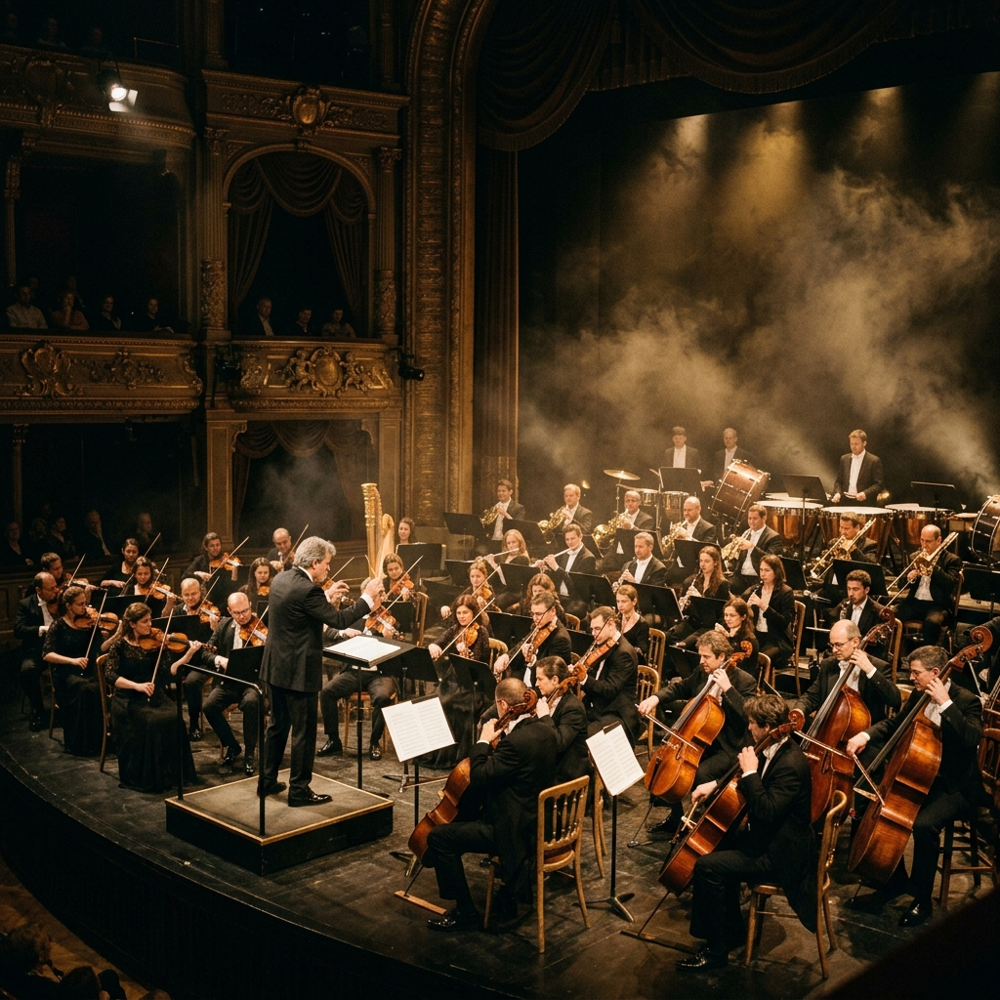

# 🎼 Opus Ludus — Learn Classical Music Composition Like a Game

<p align="center">
  
</p>

<p align="center">
  <strong>An interactive, gamified web platform for learning conservatory-level classical music composition.</strong>
</p>

<p align="center">
  <a href="https://raestrada.github.io/opusludus/"></a>
  <a href="LICENSE"></a>
  <a href="https://github.com/raestrada/opusludus/releases/latest"></a>
</p>

---

## 🌟 The Vision

**Opus Ludus** bridges the gap between complex music theory and practical composition. Designed specifically for young musicians in conservatories, orchestras, and music academies, the platform turns dry, academic exercises into a rewarding, interactive journey. 

Students progress through **7 academic levels and 39 modules** — starting with basic staff reading and expanding to advanced composition techniques such as Alberti bass, species contrapunt, pivot-chord modulation, politonality, and dodecaphonic serialism.

---

## 🎨 Key Features

### 🏛️ 1. Conservatory-Graded Curriculum
- **7 Levels of Study**: Fundamentals, Rhythm & Meter, Diatonic Harmony, Musical Forms, Advanced Harmony, Counterpoint & Polyphony, and 20th Century Techniques.
- **39 Structured Modules**: Each containing a custom-written theoretical lesson, an interactive playback example, and a composition challenge.

### ✍️ 2. Interactive Notation Editor (VexFlow 5)
- **Visual Click-to-Compose**: Select and place notes (from double-whole notes to sixteenth notes) directly on a high-contrast dark staff.
- **Measure Navigation**: Quick controls for long compositions (up to 32 measures for the final project).
- **Interactive Piano Keyboard**: Click keys to insert notes or visually inspect permitted heights.

### 🔊 3. High-Fidelity Audio Synthesis (Tone.js 15)
- **Real-Time Playback**: Synthesize and hear your compositions instantly.
- **Visual Playback Highlighting**: Watch note heads expand and glow in gold in perfect synchrony with the synthesized audio.

### 🔬 4. Strict Music Theory Evaluation Engine
- **No Stubs / True Music Analysis**: Compositions are evaluated against mathematical/theoretical rules:
  - *Voice Leading & Contrapunt*: Species counterpoint (preparation, dissonance resolution, suspensions).
  - *Chord Progressions*: Sentence structure, Alberti bass, Pivot-chord modulations, Neapolitan 6ths, and French/Italian/German augmented 6ths.
  - *Advanced Styles*: Bitonality (crescent circle of fifths check), Rondo/Sonata forms, Impressionist whole-tone scales, and 12-tone serial series.

### 🏆 5. Immersive Gamification
- **Progression Ranks**: Earn XP to rank up from *Novice* to *Apprentice*, *Composer*, *Maestro*, and finally *Virtuoso*.
- **Daily Streaks**: Maintain active composition days to gain up to a +50% streak XP bonus.
- **Milestone Badges**: Unlock badges for perfect scores, level completion, and composition lengths.
- **Visual Aids Panel (Score Penalties)**: If stuck, students can activate hints (Highlight Allowed Piano Keys, Red Error Outlining, Next-Note Suggestion) which deduct points from their final module score.

---

## 🛠️ Tech Stack & Architecture

| Layer | Technology | Description |
|---|---|---|
| **Core Architecture** | [Eleventy 3.x](https://11ty.dev) | High-performance static site generation |
| **Asset Bundler** | Webpack 5 + Babel | ES6 compiling and production minification |
| **Notation Renderer** | [VexFlow 5](https://github.com/paulrosen/vexflow) | Vector SVG staff and engraving engine |
| **Audio Engine** | [Tone.js 15](https://tonejs.github.io) | Web Audio synthesizer and scheduling |
| **Styling** | Vanilla CSS | Modern Glassmorphism, Dark Mode, and CSS variables |

```
opusludus/
├── src/                          # Source files (Eleventy input)
│   ├── _data/                    # Curriculum definitions, gamification formulas
│   ├── _includes/layouts/        # Nunjucks templates (base, modules, play)
│   ├── en/ & es/                 # Localized routes (UI strings & translations)
│   └── assets/                   # CSS, images, and client-side modules
├── public/                       # Eleventy output (compiled static site)
├── .eleventy.js                  # Eleventy build rules
├── webpack.config.js             # Webpack compilation rules
└── LICENSE                       # Licensing terms (CC BY-NC 4.0)
```

---

## 🚀 Quick Start (Local Development)

### Prerequisites
- Node.js (v18+)
- npm

### Installation
1. Clone this repository:
   ```bash
   git clone https://github.com/raestrada/opusludus.git
   cd opusludus
   ```
2. Install npm dependencies:
   ```bash
   npm install
   ```

### Running Locally
- Run parallel development servers (Eleventy dev server + Webpack watcher):
  ```bash
  npm run dev
  ```
  Open **`http://localhost:8080`** in your browser.

- To run only the Webpack watch process:
  ```bash
  npm run dev:webpack
  ```
- To run only the Eleventy hot-reload server:
  ```bash
  npm run dev:eleventy
  ```

### Build for Production
Generate optimized production bundles:
```bash
npm run build
```
Output files will be generated in `/public`.

---

## 🤝 Contributing & Open Source

We believe in open education! Anyone can collaborate on Opus Ludus:
- Check out our [Contributing Guidelines](CONTRIBUTING.md) to set up your environment and follow language policies.
- Abide by our [Code of Conduct](CODE_OF_CONDUCT.md) during interactions.
- Report security issues privately as outlined in [SECURITY.md](SECURITY.md).

---

## 📄 License

This project is licensed under the **Creative Commons Attribution-NonCommercial 4.0 International (CC BY-NC 4.0)** license. 

> [!IMPORTANT]
> **Commercial use is prohibited.** You are free to share, copy, and modify the code and content for personal and educational purposes, but you may not use it for commercial purposes (such as selling the app, charging for access, or integrating it into paid academy courses) without explicit written permission.

---
*Created with 💛 for young virtuosos. Built with Tone.js, VexFlow, and Eleventy.*
